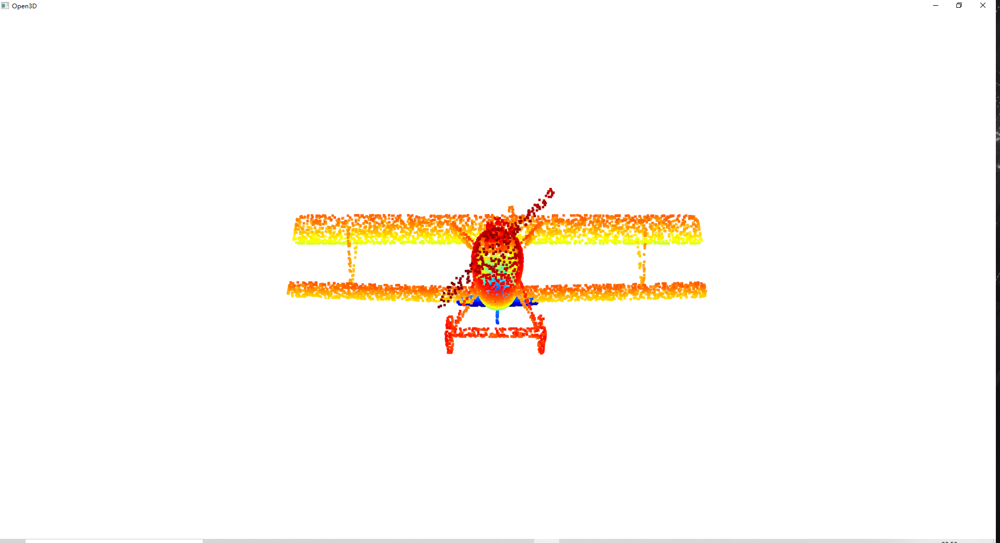
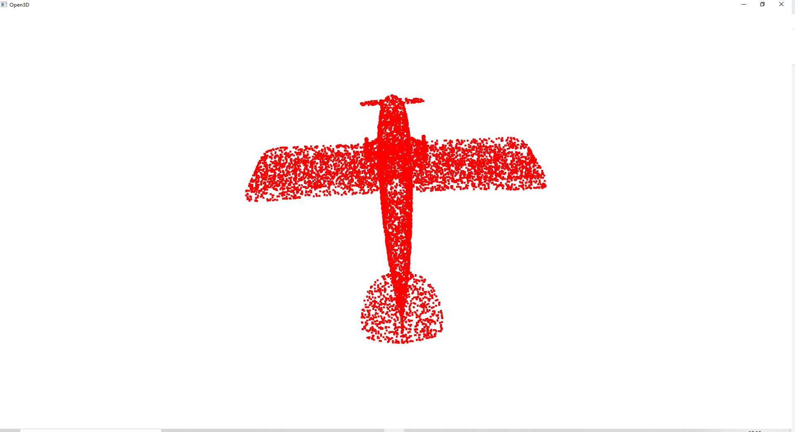
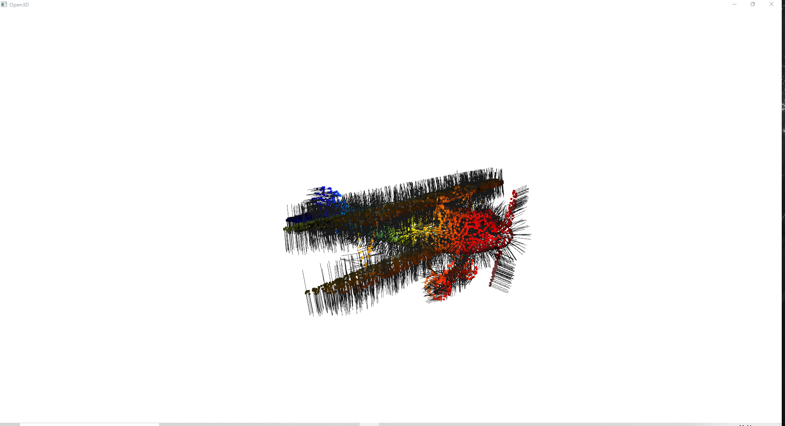
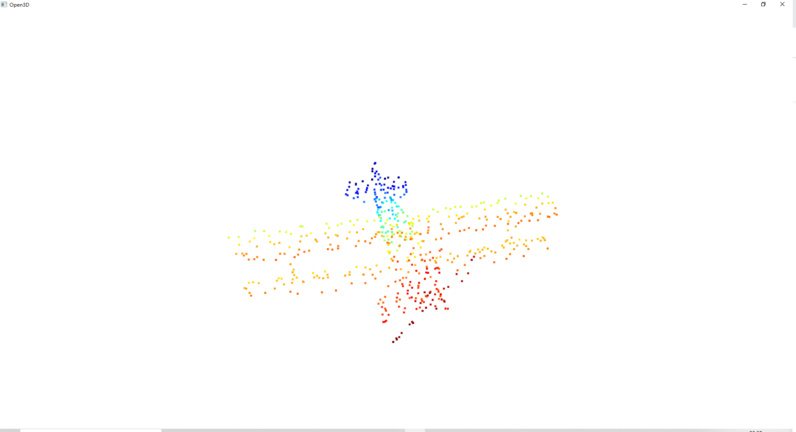
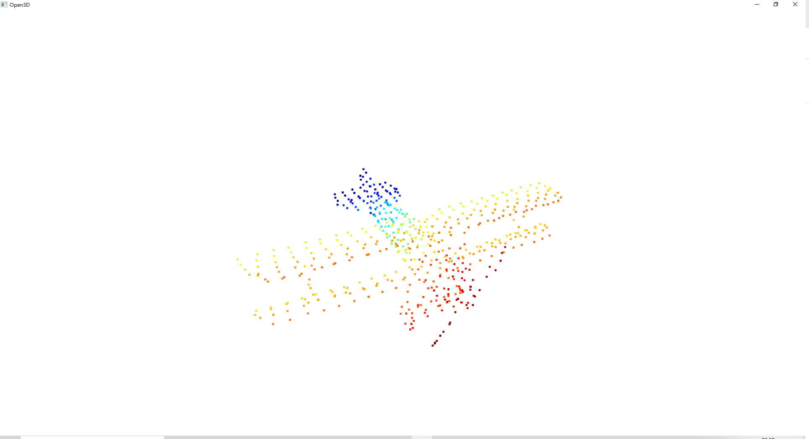

# 01-Introduction and Basic Algorithm
本次作业主要完成主成分分析(PCA)、点云法向量计算及体素滤波的代码实现，并给出对应的运行结果

## 主成分分析(PCA)与法向量计算

### 运行方式
```bash
python3 pca_normal --filename="your file name" --number_nearest=50
```
> 其中`filename`为点云文件路径，`number_nearest`为计算点云法向量时最邻近搜索的邻居数量

### 结果展示
1. 使用modelnet40_normal_resampled中的点云数据，并可视化

2. 进行PCA,将点云投影到前两个主方向上，并可视化

3. 计算各个点的法向量并进行可视化



## 体素滤波
### 运行方式
```bash
python3 voxel_filter --filename="your file name" --leaf_size=0.08 --mode=0
```
> 其中`filename`为点云文件路径，`leafsize`为体素大小，`mode`为体素内选点的模式选择，0代表中心选点，1代表随机选点

### 结果展示
1. 随机选点

2. 中心选点
